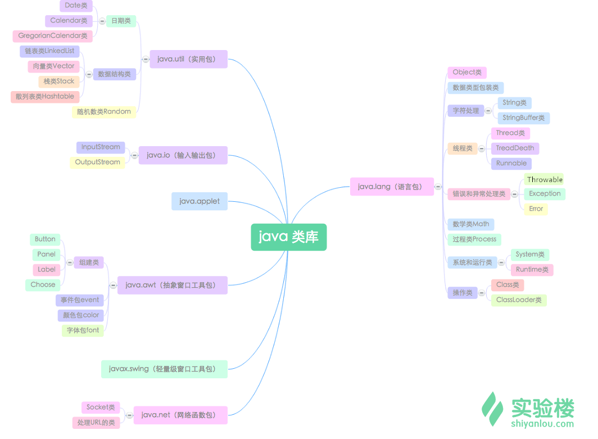
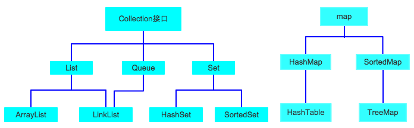
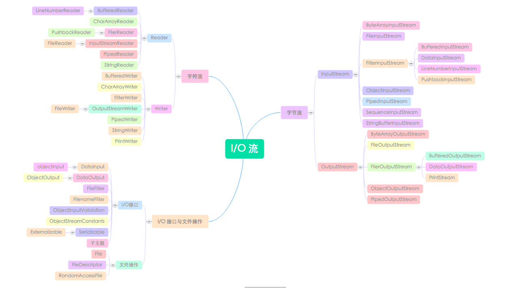
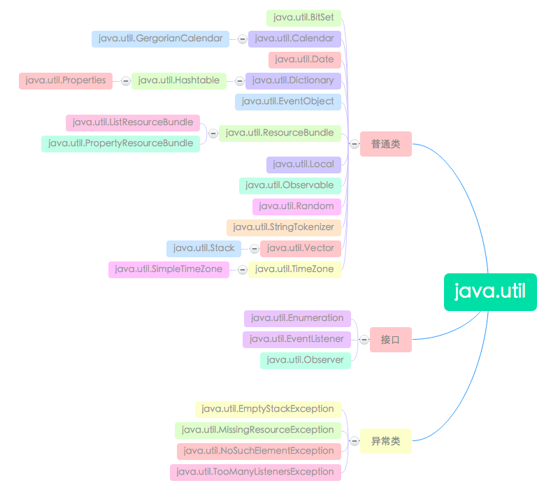
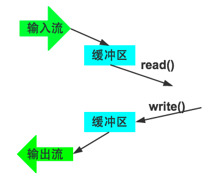
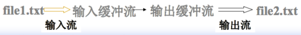

# java_lang包











构造方法：

```java
//[ ] 里的内容代表选填
BufferedInputStream(InputStream in [, int size])
BufferedOutputStream(OutputStream out [, int size])
```

举个例子，将缓冲流与文件流相接：

```java
FileInputStream in = new FileInputStream("file.txt");
FileOutputStream out = new FileOutputStream("file2.txt");
//设置输入缓冲区大小为 256 字节
BufferedInputStream bin = new BufferedInputStream(in,256)
BufferedOutputStream bout = new BufferedOutputStream(out,256)
int len;
byte bArray[] = new byte[256];
len = bin.read(bArray); //len 中得到的是实际读取的长度，bArray 中得到的是数据
```



对于 BufferedOutputStream，只有缓冲区满时，才会将数据真正送到输出流，但可以使用 `flush()` 方法人为地将尚未填满的缓冲区中的数据送出。

例如方法 copy():

```java
public void copy(InputStream in, OutputStream out) throws IOException {
    out = new BufferedOutputStream(out, 4096);
    byte[] buf = new byte[4096];
    int len = in.read(buf);
    while (len != -1) {
    out.write(buf, 0, len);
    len = in.read(buf);
    }
    //最后一次读取得数据可能不到 4096 字节
    out.flush();
}
```
