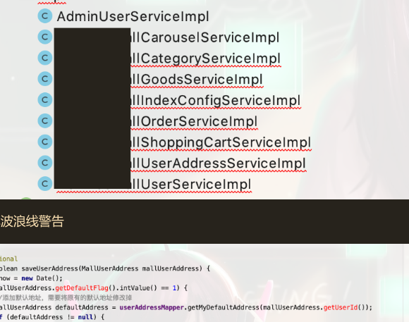

# Lombok

#### 自动生成Get Set等方法。

|col1|col2|col3|
| ------| ------| ------|
||||
||||

- @Setter 注解在属性上，为属性提供 setting 方法。
- @Getter 注解在属性上，为属性提供 getting 方法。
- @Log4j 注解在类上，为类提供一个 属性名为 log 的 log4j 日志对象。
- @NoArgsConstructor 注解在类上，为类提供一个无参的构造方法。
- @AllArgsConstructor 注解在类上，为类提供一个全参的构造方法。
- @Builder 被注解的类加个构造者模式。
- @Synchronized 加同步锁。
- @NonNull 如果给参数加个这个注解 参数为 null 会抛出空指针异常。
- @Value 注解和 @Data 类似，区别在于它会把所有成员变量默认定义为 private final 修饰，并且不会生成 set 方法。

但是可能会出现代码正确但是提示红线

