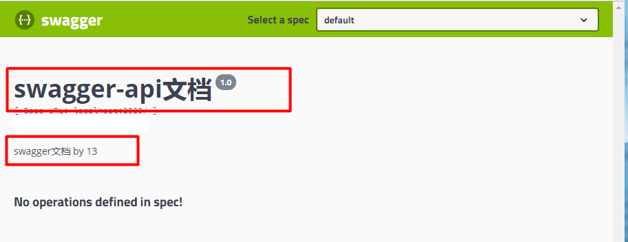

# Swagger

#### 特性

1. 自动生成API文档。
2. Swagger 提供了强大的页面测试功能来调试每个 API 接口。
3. 维护文档和修改代码整合为一体

#### 1. 产生背景

终端会==共用==很多底层业务逻辑， RESTful API 就有可能要面对多个开发人员或多个开发团队：iOS 开发、Android 开发或是 Web 开发等，为了减少与其他团队平时开发期间的频繁沟通成本，传统做法我们会创建一份 API 文档来记录所有接口细节，然而这样的做法有以下几个问题。

- 接口众多，细节复杂, 完整的 API 文档非常吃力
- 同步修改接口文档困难，

> 需要考虑不同的 HTTP 请求类型、HTTP 头部信息、HTTP 请求内容等
>
> 随着时间推移，不断修改接口实现的时候都必须同步，维护起来十分麻烦。

**因此Swagger诞生了**

<u>Swagger 的目标是为 RESTful API 定义一个标准的，与语言无关的接口，使人和计算机在看不到源码或看不到文档或不能通过网络流量检测的情况下能发现和理解各种服务的功能。</u>

#### 2. 使用注解生成文档

使用注解来标记出需要在 API 文档中展示的信息，Swagger 会根据项目中标记的注解来生成对应的 API 文档。

#### 3. 添加依赖

```xml
      <dependency>
            <groupId>io.springfox</groupId>
            <artifactId>springfox-swagger2</artifactId>
            <version>2.8.0</version>
        </dependency>
        <dependency>
            <groupId>io.springfox</groupId>
            <artifactId>springfox-swagger-ui</artifactId>
            <version>2.8.0</version>
        </dependency>
```

#### 4. 配置Swagger类

新建 `config` 包，在 `config` 包中新增 `Swagger2Config.java`，代码如下

```java
package com.lou.springboot.config;

import org.springframework.context.annotation.Bean;
import org.springframework.context.annotation.Configuration;
import springfox.documentation.builders.ApiInfoBuilder;
import springfox.documentation.builders.PathSelectors;
import springfox.documentation.builders.RequestHandlerSelectors;
import springfox.documentation.service.ApiInfo;
import springfox.documentation.spi.DocumentationType;
import springfox.documentation.spring.web.plugins.Docket;
import springfox.documentation.swagger2.annotations.EnableSwagger2;

@Configuration
@EnableSwagger2
public class Swagger2Config {

    @Bean
    public Docket api() {
        return new Docket(DocumentationType.SWAGGER_2)
                .apiInfo(apiInfo())
                .select()
                .apis(RequestHandlerSelectors.basePackage("com.lou.springboot.controller"))// 修改为自己的 controller 包路径
                .paths(PathSelectors.any())
                .build();
    }

    private ApiInfo apiInfo() {
        return new ApiInfoBuilder()
                .title("swagger-api文档")
                .description("swagger文档 by 13")
                .version("1.0")
                .build();
    }
}
```

- @Configuration，启动时加载此类
- @EnableSwagger2，表示此项目启用 Swagger API 文档

`api()` 方法用于返回实例 Docket（Swagger API 摘要），也是在该方法中指定需要扫描的控制器包路径，只有此路径下的 Controller 类才会自动生成 Swagger API 文档。

`apiInfo()` 方法中主要是配置一些基础信息，包括配置页面展示的基本信息包括，标题、描述、版本、服务条款、联系方式等。

配置完成之后启动项目，在浏览器中输入网址 /swagger-ui.html，即可看到 Swagger 页面，效果如下：



此时只有基础的配置信息，并没有文档信息，接下来我们需要在我们配置的 basePackage("com.lou.springboot.controller") 包中新建 Controller 类。

#### 4. 一个controller实例

```java
package com.lou.springboot.controller;

import com.lou.springboot.entity.User;
import io.swagger.annotations.ApiImplicitParam;
import io.swagger.annotations.ApiImplicitParams;
import io.swagger.annotations.ApiOperation;
import org.springframework.web.bind.annotation.*;

import java.util.*;

@RestController
public class TestSwaggerController {

    static Map<Integer, User> usersMap = Collections.synchronizedMap(new HashMap<Integer, User>());

    // 初始化 usersMap
    static {
        User user = new User();
        user.setId(1);
        user.setName("lou1");
        user.setPassword("111111");
        User user2 = new User();
        user2.setId(2);
        user2.setName("lou2");
        user2.setPassword("222222");
        usersMap.put(1, user);
        usersMap.put(2, user2);
    }

    @ApiOperation(value = "获取用户列表", notes = "")
    @GetMapping("/users")
    public List<User> getUserList() {
        List<User> users = new ArrayList<User>(usersMap.values());
        return users;
    }

    @ApiOperation(value = "新增用户", notes = "根据User对象新增用户")
    @ApiImplicitParam(name = "user", value = "用户实体", required = true, dataType = "User")
    @PostMapping("/users")
    public String postUser(@RequestBody User user) {
        usersMap.put(user.getId(), user);
        return "新增成功";
    }

    @ApiOperation(value = "获取用户详细信息", notes = "根据id来获取用户详细信息")
    @ApiImplicitParam(name = "id", value = "用户id", required = true, dataType = "int")
    @GetMapping("/users/{id}")
    public User getUser(@PathVariable Integer id) {
        return usersMap.get(id);
    }

    @ApiOperation(value = "更新用户详细信息", notes = "")
    @ApiImplicitParams({
            @ApiImplicitParam(name = "id", value = "用户id", required = true, dataType = "int"),
            @ApiImplicitParam(name = "user", value = "用户实体user", required = true, dataType = "User")
    })
    @PutMapping("/users/{id}")
    public String putUser(@PathVariable Integer id, @RequestBody User user) {
        User tempUser = usersMap.get(id);
        tempUser.setName(user.getName());
        tempUser.setPassword(user.getPassword());
        usersMap.put(id, tempUser);
        return "更新成功";
    }

    @ApiOperation(value = "删除用户", notes = "根据id删除对象")
    @ApiImplicitParam(name = "id", value = "用户id", required = true, dataType = "int")
    @DeleteMapping("/users/{id}")
    public String deleteUser(@PathVariable Integer id) {
        usersMap.remove(id);
        return "删除成功";
    }
}
```

`@ApiOperation`注解来给 API 增加说明、通过`@ApiImplicitParams`、`@ApiImplicitParam`注解来给参数增加说明。、

​​
