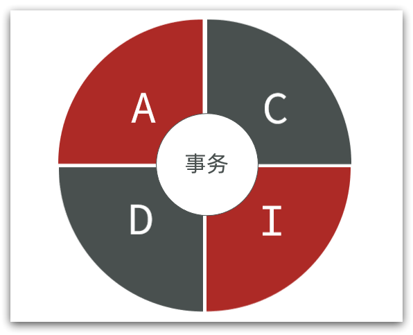
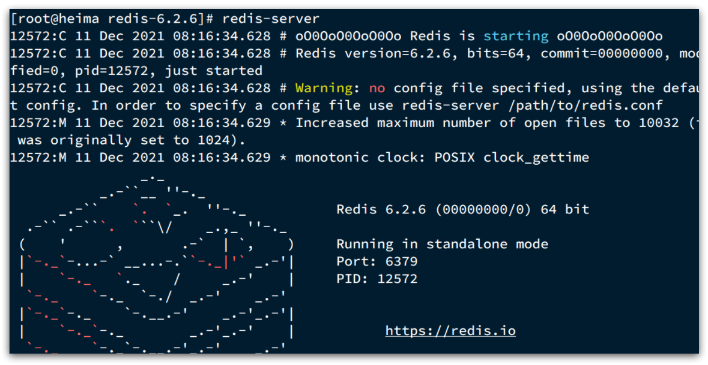
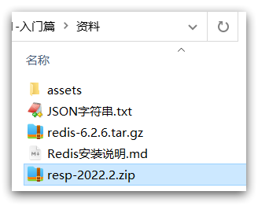
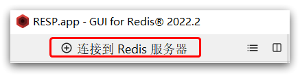
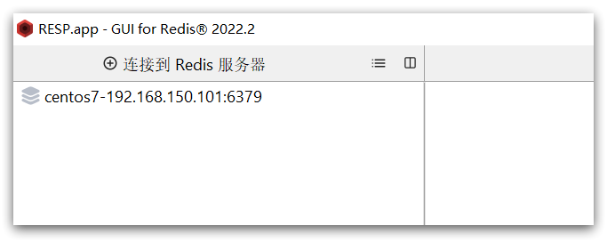
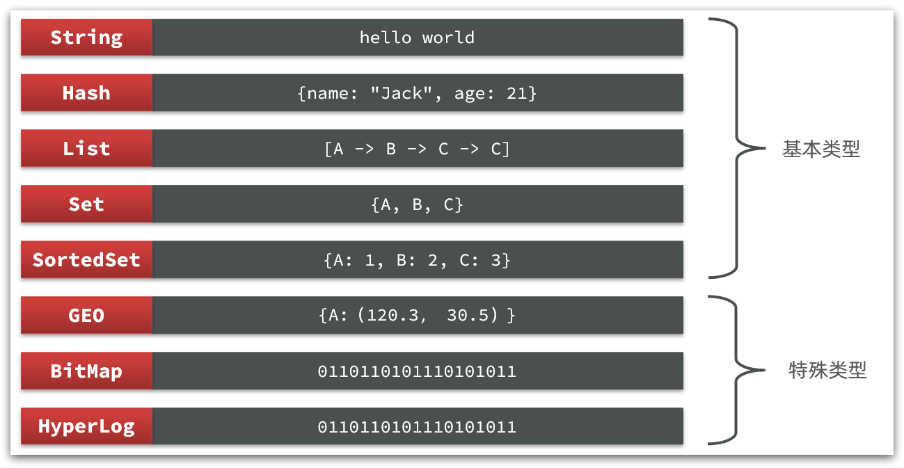
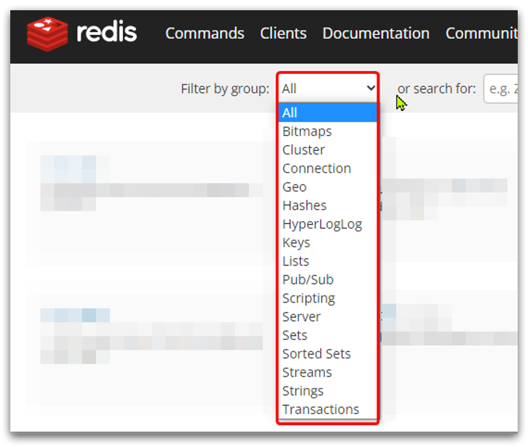
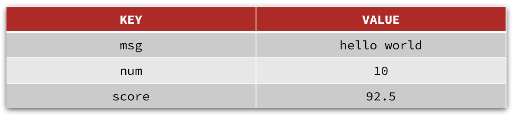
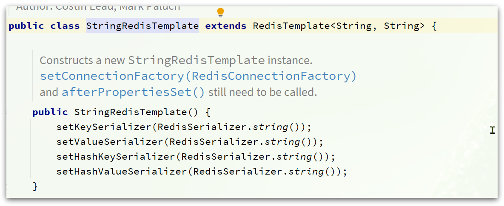

# 01.快速入门

# Redis 快速入门

Redis 的常见命令和客户端使用

# 1.初识 Redis

Redis 是一种键值型的 NoSql 数据库，这里有两个关键字：

- 键值型
- NoSql

其中**键值型**，是指 Redis 中存储的数据都是以 key、value 对的形式存储，而 value 的形式多种多样，可以是字符串、数值、甚至 json：


而 NoSql 则是相对于传统关系型数据库而言，有很大差异的一种数据库。

## 1.1.认识 NoSQL

**NoSql** 可以翻译做 Not Only Sql（不仅仅是 SQL），或者是 No Sql（非 Sql 的）数据库。是相对于传统关系型数据库而言，有很大差异的一种特殊的数据库，因此也称之为**非关系型数据库**。

### 1.1.1.结构化与非结构化

传统关系型数据库是结构化数据，每一张表都有严格的约束信息：字段名、字段数据类型、字段约束等等信息，插入的数据必须遵守这些约束：


而 NoSql 则对数据库格式没有严格约束，往往形式松散，自由。

可以是键值型：


也可以是文档型：


甚至可以是图格式：


### 1.1.2.关联和非关联

传统数据库的表与表之间往往存在关联，例如外键：


而非关系型数据库不存在关联关系，要维护关系要么靠代码中的业务逻辑，要么靠数据之间的耦合：

```json
{
  id: 1,
  name: "张三",
  orders: [
    {
       id: 1,
       item: {
     id: 10, title: "荣耀6", price: 4999
       }
    },
    {
       id: 2,
       item: {
     id: 20, title: "小米11", price: 3999
       }
    }
  ]
}
```

此处要维护“张三”的订单与商品“荣耀”和“小米 11”的关系，不得不冗余的将这两个商品保存在张三的订单文档中，不够优雅。还是建议用业务来维护关联关系。

### 1.1.3.查询方式

传统关系型数据库会基于 Sql 语句做查询，语法有统一标准；

而不同的非关系数据库查询语法差异极大，五花八门各种各样。


### 1.1.4.事务

传统关系型数据库能满足事务 ACID 的原则。



而非关系型数据库往往不支持事务，或者不能严格保证 ACID 的特性，只能实现基本的一致性。

### 1.1.5.总结

除了上述四点以外，在存储方式、扩展性、查询性能上关系型与非关系型也都有着显著差异，总结如下：


- 存储方式

  - 关系型数据库基于磁盘进行存储，会有大量的磁盘 IO，对性能有一定影响
  - 非关系型数据库，他们的操作更多的是依赖于内存来操作，内存的读写速度会非常快，性能自然会好一些

* 扩展性

  * 关系型数据库集群模式一般是主从，主从数据一致，起到数据备份的作用，称为垂直扩展。
  * 非关系型数据库可以将数据拆分，存储在不同机器上，可以保存海量数据，解决内存大小有限的问题。称为水平扩展。
  * 关系型数据库因为表之间存在关联关系，如果做水平扩展会给数据查询带来很多麻烦

## 1.2.认识 Redis

Redis 诞生于 2009 年全称是 **Re**mote  **D**ictionary **S**erver 远程词典服务器，是一个基于内存的键值型 NoSQL 数据库。

**特征**：

- 键值（key-value）型，value 支持多种不同数据结构，功能丰富
- 单线程，每个命令具备原子性
- 低延迟，速度快（基于内存、IO 多路复用、良好的编码）。
- 支持数据持久化
- 支持主从集群、分片集群
- 支持多语言客户端

**作者**：Antirez

Redis 的官方网站地址：https://redis.io/

## 1.3.安装 Redis

大多数企业都是基于 Linux 服务器来部署项目，而且 Redis 官方也没有提供 Windows 版本的安装包。因此课程中我们会基于 Linux 系统来安装 Redis.

此处选择的 Linux 版本为 CentOS 7.

### 1.3.1.依赖库

Redis 是基于 C 语言编写的，因此首先需要安装 Redis 所需要的 gcc 依赖：

```sh
yum install -y gcc tcl
```

### 1.3.2.上传安装包并解压

然后将课前资料提供的 Redis 安装包上传到虚拟机的任意目录：


例如，我放到了/usr/local/src 目录：


解压缩：

```sh
tar -xzf redis-6.2.6.tar.gz
```

解压后：


进入 redis 目录：

```sh
cd redis-6.2.6
```

运行编译命令：

```sh
make && make install
```

如果没有出错，应该就安装成功了。

默认的安装路径是在 `/usr/local/bin` 目录下：


该目录已经默认配置到环境变量，因此可以在任意目录下运行这些命令。其中：

- redis-cli：是 redis 提供的命令行客户端
- redis-server：是 redis 的服务端启动脚本
- redis-sentinel：是 redis 的哨兵启动脚本

### 1.3.3.启动

redis 的启动方式有很多种，例如：

- 默认启动
- 指定配置启动
- 开机自启

### 1.3.4.默认启动

安装完成后，在任意目录输入 redis-server 命令即可启动 Redis：

```
redis-server
```

如图：



这种启动属于 `前台启动`，会阻塞整个会话窗口，窗口关闭或者按下 `CTRL + C` 则 Redis 停止。不推荐使用。

### 1.3.5.指定配置启动

如果要让 Redis 以 `后台` 方式启动，则必须修改 Redis 配置文件，就在我们之前解压的 redis 安装包下（`/usr/local/src/redis-6.2.6`），名字叫 redis.conf：


我们先将这个配置文件备份一份：

```
cp redis.conf redis.conf.bck
```

然后修改 redis.conf 文件中的一些配置：

```properties
# 允许访问的地址，默认是127.0.0.1，会导致只能在本地访问。修改为0.0.0.0则可以在任意IP访问，生产环境不要设置为0.0.0.0
bind 0.0.0.0
# 守护进程，修改为yes后即可后台运行
daemonize yes 
# 密码，设置后访问Redis必须输入密码
requirepass 123321
```

Redis 的其它常见配置：

```properties
# 监听的端口
port 6379
# 工作目录，默认是当前目录，也就是运行redis-server时的命令，日志、持久化等文件会保存在这个目录
dir .
# 数据库数量，设置为1，代表只使用1个库，默认有16个库，编号0~15
databases 1
# 设置redis能够使用的最大内存
maxmemory 512mb
# 日志文件，默认为空，不记录日志，可以指定日志文件名
logfile "redis.log"
```

启动 Redis：

```sh
# 进入redis安装目录 
cd /usr/local/src/redis-6.2.6
# 启动
redis-server redis.conf
```

停止服务：

```sh
# 利用redis-cli来执行 shutdown 命令，即可停止 Redis 服务，
# 因为之前配置了密码，因此需要通过 -u 来指定密码
redis-cli -u 123321 shutdown
```

### 1.3.6.开机自启

我们也可以通过配置来实现开机自启。

首先，新建一个系统服务文件：

```sh
vi /etc/systemd/system/redis.service
```

内容如下：

```conf
[Unit]
Description=redis-server
After=network.target

[Service]
Type=forking
ExecStart=/usr/local/bin/redis-server /usr/local/src/redis-6.2.6/redis.conf
PrivateTmp=true

[Install]
WantedBy=multi-user.target
```

然后重载系统服务：

```sh
systemctl daemon-reload
```

现在，我们可以用下面这组命令来操作 redis 了：

```sh
# 启动
systemctl start redis
# 停止
systemctl stop redis
# 重启
systemctl restart redis
# 查看状态
systemctl status redis
```

执行下面的命令，可以让 redis 开机自启：

```sh
systemctl enable redis
```

## 1.4.Redis 桌面客户端

安装完成 Redis，我们就可以操作 Redis，实现数据的 CRUD 了。这需要用到 Redis 客户端，包括：

- 命令行客户端
- 图形化桌面客户端
- 编程客户端

### 1.4.1.Redis 命令行客户端

Redis 安装完成后就自带了命令行客户端：redis-cli，使用方式如下：

```sh
redis-cli [options] [commonds]
```

其中常见的 options 有：

- `-h 127.0.0.1`：指定要连接的 redis 节点的 IP 地址，默认是 127.0.0.1
- `-p 6379`：指定要连接的 redis 节点的端口，默认是 6379
- `-a 123321`：指定 redis 的访问密码

其中的 commonds 就是 Redis 的操作命令，例如：

- `ping`：与 redis 服务端做心跳测试，服务端正常会返回 `pong`

不指定 commond 时，会进入 `redis-cli` 的交互控制台：


### 1.4.2.图形化桌面客户端

GitHub 上的大神编写了 Redis 的图形化桌面客户端，地址：https://github.com/uglide/RedisDesktopManager

不过该仓库提供的是 RedisDesktopManager 的源码，并未提供 windows 安装包。

在下面这个仓库可以找到安装包：https://github.com/lework/RedisDesktopManager-Windows/releases

### 1.4.3.安装

在课前资料中可以找到 Redis 的图形化桌面客户端：



解压缩后，运行安装程序即可安装：


安装完成后，在安装目录下找到 rdm.exe 文件：


双击即可运行：


### 1.4.4.建立连接

点击左上角的 `连接到Redis服务器` 按钮：



在弹出的窗口中填写 Redis 服务信息：


点击确定后，在左侧菜单会出现这个链接：



点击即可建立连接了。


Redis 默认有 16 个仓库，编号从 0 至 15.  通过配置文件可以设置仓库数量，但是不超过 16，并且不能自定义仓库名称。

如果是基于 redis-cli 连接 Redis 服务，可以通过 select 命令来选择数据库：

```sh
# 选择 0号库
select 0
```

# 2.Redis 常见命令

Redis 是典型的 key-value 数据库，key 一是字符串，而 value 包含很多不同的数据类型：



Redis 为了方便我们学习，将操作不同数据类型的命令也做了分组，在官网（ [https://redis.io/commands ](https://redis.io/commands)）可以查看到不同的命令：



不同类型的命令称为一个 group，我们也可以通过 help 命令来查看各种不同 group 的命令：


接下来，我们就学习常见的五种基本数据类型的相关命令。

## 2.1.Redis 通用命令

通用指令是部分数据类型的，都可以使用的指令，常见的有：

- KEYS：查看符合模板的所有 key
- DEL：删除一个指定的 key
- EXISTS：判断 key 是否存在
- EXPIRE：给一个 key 设置有效期，有效期到期时该 key 会被自动删除
- TTL：查看一个 KEY 的剩余有效期

通过 help [command] 可以查看一个命令的具体用法，例如：

```sh
# 查看keys命令的帮助信息：
127.0.0.1:6379> help keys

KEYS pattern
summary: Find all keys matching the given pattern
since: 1.0.0
group: generic
```

## 2.2.String 类型

String 类型，也就是字符串类型，是 Redis 中最简单的存储类型。

其 value 是字符串，不过根据字符串的格式不同，又可以分为 3 类：

- string：普通字符串
- int：整数类型，可以做自增、自减操作
- float：浮点类型，可以做自增、自减操作

不管是哪种格式，底层都是字节数组形式存储，只不过是编码方式不同。字符串类型的最大空间不能超过 512m.



### 2.2.1.String 的常见命令

String 的常见命令有：

- SET：添加或者修改已经存在的一个 String 类型的键值对
- GET：根据 key 获取 String 类型的 value
- MSET：批量添加多个 String 类型的键值对
- MGET：根据多个 key 获取多个 String 类型的 value
- INCR：让一个整型的 key 自增 1
- INCRBY:让一个整型的 key 自增并指定步长，例如：incrby num 2 让 num 值自增 2
- INCRBYFLOAT：让一个浮点类型的数字自增并指定步长
- SETNX：添加一个 String 类型的键值对，前提是这个 key 不存在，否则不执行
- SETEX：添加一个 String 类型的键值对，并且指定有效期

### 2.2.2.Key 结构

Redis 没有类似 MySQL 中的 Table 的概念，我们该如何区分不同类型的 key 呢？

例如，需要存储用户、商品信息到 redis，有一个用户 id 是 1，有一个商品 id 恰好也是 1，此时如果使用 id 作为 key，那就会冲突了，该怎么办？

我们可以通过给 key 添加前缀加以区分，不过这个前缀不是随便加的，有一定的规范：

Redis 的 key 允许有多个单词形成层级结构，多个单词之间用':'隔开，格式如下：

```
    项目名:业务名:类型:id
```

这个格式并非固定，也可以根据自己的需求来删除或添加词条。这样以来，我们就可以把不同类型的数据区分开了。从而避免了 key 的冲突问题。

例如我们的项目名称叫 heima，有 user 和 product 两种不同类型的数据，我们可以这样定义 key：

- user 相关的 key：**heima:user:1**
- product 相关的 key：**heima:product:1**

如果 Value 是一个 Java 对象，例如一个 User 对象，则可以将对象序列化为 JSON 字符串后存储：

|**KEY**|**VALUE**|
| ---------------| -------------------------------------------|
|heima:user:1|{"id":1,  "name": "Jack", "age": 21}|
|heima:product:1|{"id":1,  "name": "小米 11", "price": 4999}|

并且，在 Redis 的桌面客户端中，还会以相同前缀作为层级结构，让数据看起来层次分明，关系清晰：


## 2.3.Hash 类型

Hash 类型，也叫散列，其 value 是一个无序字典，类似于 Java 中的 HashMap 结构。

String 结构是将对象序列化为 JSON 字符串后存储，当需要修改对象某个字段时很不方便：


Hash 结构可以将对象中的每个字段独立存储，可以针对单个字段做 CRUD：


Hash 的常见命令有：

- HSET key field value：添加或者修改 hash 类型 key 的 field 的值
- HGET key field：获取一个 hash 类型 key 的 field 的值
- HMSET：批量添加多个 hash 类型 key 的 field 的值
- HMGET：批量获取多个 hash 类型 key 的 field 的值
- HGETALL：获取一个 hash 类型的 key 中的所有的 field 和 value
- HKEYS：获取一个 hash 类型的 key 中的所有的 field
- HINCRBY:让一个 hash 类型 key 的字段值自增并指定步长
- HSETNX：添加一个 hash 类型的 key 的 field 值，前提是这个 field 不存在，否则不执行

## 2.4.List 类型

Redis 中的 List 类型与 Java 中的 LinkedList 类似，可以看做是一个双向链表结构。既可以支持正向检索和也可以支持反向检索。

特征也与 LinkedList 类似：

- 有序
- 元素可以重复
- 插入和删除快
- 查询速度一般

常用来存储一个有序数据，例如：朋友圈点赞列表，评论列表等。

List 的常见命令有：

- LPUSH key element ... ：向列表左侧插入一个或多个元素
- LPOP key：移除并返回列表左侧的第一个元素，没有则返回 nil
- RPUSH key element ... ：向列表右侧插入一个或多个元素
- RPOP key：移除并返回列表右侧的第一个元素
- LRANGE key star end：返回一段角标范围内的所有元素
- BLPOP 和 BRPOP：与 LPOP 和 RPOP 类似，只不过在没有元素时等待指定时间，而不是直接返回 nil

## 2.5.Set 类型

Redis 的 Set 结构与 Java 中的 HashSet 类似，可以看做是一个 value 为 null 的 HashMap。因为也是一个 hash 表，因此具备与 HashSet 类似的特征：

- 无序
- 元素不可重复
- 查找快
- 支持交集、并集、差集等功能

Set 的常见命令有：

- SADD key member ... ：向 set 中添加一个或多个元素
- SREM key member ... : 移除 set 中的指定元素
- SCARD key： 返回 set 中元素的个数
- SISMEMBER key member：判断一个元素是否存在于 set 中
- SMEMBERS：获取 set 中的所有元素
- SINTER key1 key2 ... ：求 key1 与 key2 的交集

例如两个集合：s1 和 s2:

​​

求交集：SINTER s1 s2

求 s1 与 s2 的不同：SDIFF s1 s2


练习：

1. 将下列数据用 Redis 的 Set 集合来存储：

- 张三的好友有：李四、王五、赵六
- 李四的好友有：王五、麻子、二狗

2. 利用 Set 的命令实现下列功能：

- 计算张三的好友有几人
- 计算张三和李四有哪些共同好友
- 查询哪些人是张三的好友却不是李四的好友
- 查询张三和李四的好友总共有哪些人
- 判断李四是否是张三的好友
- 判断张三是否是李四的好友
- 将李四从张三的好友列表中移除

## 2.6.SortedSet 类型

Redis 的 SortedSet 是一个可排序的 set 集合，与 Java 中的 TreeSet 有些类似，但底层数据结构却差别很大。SortedSet 中的每一个元素都带有一个 score 属性，可以基于 score 属性对元素排序，底层的实现是一个跳表（SkipList）加 hash 表。

SortedSet 具备下列特性：

- 可排序
- 元素不重复
- 查询速度快

因为 SortedSet 的可排序特性，经常被用来实现排行榜这样的功能。

SortedSet 的常见命令有：

- ZADD key score member：添加一个或多个元素到 sorted set ，如果已经存在则更新其 score 值
- ZREM key member：删除 sorted set 中的一个指定元素
- ZSCORE key member : 获取 sorted set 中的指定元素的 score 值
- ZRANK key member：获取 sorted set 中的指定元素的排名
- ZCARD key：获取 sorted set 中的元素个数
- ZCOUNT key min max：统计 score 值在给定范围内的所有元素的个数
- ZINCRBY key increment member：让 sorted set 中的指定元素自增，步长为指定的 increment 值
- ZRANGE key min max：按照 score 排序后，获取指定排名范围内的元素
- ZRANGEBYSCORE key min max：按照 score 排序后，获取指定 score 范围内的元素
- ZDIFF、ZINTER、ZUNION：求差集、交集、并集

注意：所有的排名默认都是升序，如果要降序则在命令的 Z 后面添加 REV 即可，例如：

- **升序**获取 sorted set 中的指定元素的排名：ZRANK key member
- **降序**获取 sorted set 中的指定元素的排名：ZREVRANK key memeber

练习题：

将班级的下列学生得分存入 Redis 的 SortedSet 中：

Jack 85, Lucy 89, Rose 82, Tom 95, Jerry 78, Amy 92, Miles 76

并实现下列功能：

- 删除 Tom 同学
- 获取 Amy 同学的分数
- 获取 Rose 同学的排名
- 查询 80 分以下有几个学生
- 给 Amy 同学加 2 分
- 查出成绩前 3 名的同学
- 查出成绩 80 分以下的所有同学

# 3.Redis 的 Java 客户端

在 Redis 官网中提供了各种语言的客户端，地址：https://redis.io/docs/clients/


其中 Java 客户端也包含很多：


标记为*的就是推荐使用的 java 客户端，包括：

- Jedis 和 Lettuce：这两个主要是提供了 Redis 命令对应的 API，方便我们操作 Redis，而 SpringDataRedis 又对这两种做了抽象和封装，因此我们后期会直接以 SpringDataRedis 来学习。
- Redisson：是在 Redis 基础上实现了分布式的可伸缩的 java 数据结构，例如 Map、Queue 等，而且支持跨进程的同步机制：Lock、Semaphore 等待，比较适合用来实现特殊的功能需求。

## 3.1.Jedis 客户端

Jedis 的官网地址： https://github.com/redis/jedis

### 3.1.1.快速入门

我们先来个快速入门：

1）引入依赖：

```xml
<!--jedis-->
<dependency>
    <groupId>redis.clients</groupId>
    <artifactId>jedis</artifactId>
    <version>3.7.0</version>
</dependency>
<!--单元测试-->
<dependency>
    <groupId>org.junit.jupiter</groupId>
    <artifactId>junit-jupiter</artifactId>
    <version>5.7.0</version>
    <scope>test</scope>
</dependency>
```

2）建立连接

新建一个单元测试类，内容如下：

```java
private Jedis jedis;

@BeforeEach
void setUp() {
    // 1.建立连接
    // jedis = new Jedis("192.168.150.101", 6379);
    jedis = JedisConnectionFactory.getJedis();
    // 2.设置密码
    jedis.auth("123321");
    // 3.选择库
    jedis.select(0);
}
```

3）测试：

```java
@Test
void testString() {
    // 存入数据
    String result = jedis.set("name", "虎哥");
    System.out.println("result = " + result);
    // 获取数据
    String name = jedis.get("name");
    System.out.println("name = " + name);
}

@Test
void testHash() {
    // 插入hash数据
    jedis.hset("user:1", "name", "Jack");
    jedis.hset("user:1", "age", "21");

    // 获取
    Map<String, String> map = jedis.hgetAll("user:1");
    System.out.println(map);
}
```

4）释放资源

```java
@AfterEach
void tearDown() {
    if (jedis != null) {
        jedis.close();
    }
}
```

### 3.1.2.连接池

Jedis 本身是线程不安全的，并且频繁的创建和销毁连接会有性能损耗，因此我们推荐大家使用 Jedis 连接池代替 Jedis 的直连方式。

```java
package com.heima.jedis.util;

import redis.clients.jedis.*;

public class JedisConnectionFactory {

    private static JedisPool jedisPool;

    static {
        // 配置连接池
        JedisPoolConfig poolConfig = new JedisPoolConfig();
        poolConfig.setMaxTotal(8);
        poolConfig.setMaxIdle(8);
        poolConfig.setMinIdle(0);
        poolConfig.setMaxWaitMillis(1000);
        // 创建连接池对象，参数：连接池配置、服务端ip、服务端端口、超时时间、密码
        jedisPool = new JedisPool(poolConfig, "192.168.150.101", 6379, 1000, "123321");
    }

    public static Jedis getJedis(){
        return jedisPool.getResource();
    }
}
```

## 3.2. 

SpringData 是 Spring 中数据操作的模块，包含对各种数据库的集成，其中对 Redis 的集成模块就叫做 SpringDataRedis，官网地址：https://spring.io/projects/spring-data-redis

- 提供了对不同 Redis 客户端的整合（Lettuce 和 Jedis）
- 提供了pupurG
- 支持 Rjjedis 的发布订阅模型
- 支持 Redis 哨兵和 Redis 集群
- 支持基于 Lettuce 的响应式编程
- 支持基于 JDK、JSON、字符串、Spring 对象的数据序列化及反序列化
- 支持基于 Redis 的 JDKCollection 实现

SpringDataRedis 中提供了 RedisTemplate 工具类，其中封装了各种对 Redis 的操作。并且将不同数据类型的操作 API 封装到了不同的类型中：


### 3.2.1.快速入门

SpringBoot 已经提供了对 SpringDataRedis 的支持，使用非常简单。

首先，新建一个 maven 项目，然后按照下面步骤执行：

#### 1）引入依赖

```xml
<?xml version="1.0" encoding="UTF-8"?>
<project xmlns="http://maven.apache.org/POM/4.0.0" xmlns:xsi="http://www.w3.org/2001/XMLSchema-instance"
         xsi:schemaLocation="http://maven.apache.org/POM/4.0.0 https://maven.apache.org/xsd/maven-4.0.0.xsd">
    <modelVersion>4.0.0</modelVersion>
    <parent>
        <groupId>org.springframework.boot</groupId>
        <artifactId>spring-boot-starter-parent</artifactId>
        <version>2.5.7</version>
        <relativePath/> <!-- lookup parent from repository -->
    </parent>
    <groupId>com.heima</groupId>
    <artifactId>redis-demo</artifactId>
    <version>0.0.1-SNAPSHOT</version>
    <name>redis-demo</name>
    <description>Demo project for Spring Boot</description>
    <properties>
        <java.version>1.8</java.version>
    </properties>
    <dependencies>
        <!--redis依赖-->
        <dependency>
            <groupId>org.springframework.boot</groupId>
            <artifactId>spring-boot-starter-data-redis</artifactId>
        </dependency>
        <!--common-pool-->
        <dependency>
            <groupId>org.apache.commons</groupId>
            <artifactId>commons-pool2</artifactId>
        </dependency>
        <!--Jackson依赖-->
        <dependency>
            <groupId>com.fasterxml.jackson.core</groupId>
            <artifactId>jackson-databind</artifactId>
        </dependency>
        <dependency>
            <groupId>org.projectlombok</groupId>
            <artifactId>lombok</artifactId>
            <optional>true</optional>
        </dependency>
        <dependency>
            <groupId>org.springframework.boot</groupId>
            <artifactId>spring-boot-starter-test</artifactId>
            <scope>test</scope>
        </dependency>
    </dependencies>

    <build>
        <plugins>
            <plugin>
                <groupId>org.springframework.boot</groupId>
                <artifactId>spring-boot-maven-plugin</artifactId>
                <configuration>
                    <excludes>
                        <exclude>
                            <groupId>org.projectlombok</groupId>
                            <artifactId>lombok</artifactId>
                        </exclude>
                    </excludes>
                </configuration>
            </plugin>
        </plugins>
    </build>

</project>
```

#### 2）配置 Redis

```yaml
spring:
  redis:
    host: 192.168.150.101
    port: 6379
    password: 123321
    lettuce:
      pool:
        max-active: 8
        max-idle: 8
        min-idle: 0
        max-wait: 100ms
```

#### 3）注入 RedisTemplate

因为有了 SpringBoot 的自动装配，我们可以拿来就用：

```java
@SpringBootTest
class RedisStringTests {

    @Autowired
    private RedisTemplate redisTemplate;
}
```

#### 4）编写测试

```java
@SpringBootTest
class RedisStringTests {

    @Autowired
    private RedisTemplate redisTemplate;

    @Test
    void testString() {
        // 写入一条String数据
        redisTemplate.opsForValue().set("name", "虎哥");
        // 获取string数据
        String name = (string)RedisTemplate.opsForValue().get("name");
        System.out.println("name = " + name);
    }
}
```

### 3.2.2.自定义序列化

RedisTemplate 可以接收任意 Object 作为值写入 Redis：


只不过写入前会把 Object 序列化为字节形式，默认是采用 JDK 序列化，得到的结果是这样的：


缺点：

- 可读性差
- 内存占用较大

我们可以自定义 RedisTemplate 的序列化方式，代码如下：

```java
@Configuration
public class RedisConfig {

    @Bean
    public RedisTemplate<String, Object> redisTemplate(RedisConnectionFactory connectionFactory){
        // 创建RedisTemplate对象
        RedisTemplate<String, Object> template = new RedisTemplate<>();
        // 设置连接工厂
        template.setConnectionFactory(connectionFactory);
        // 创建JSON序列化工具
        GenericJackson2JsonRedisSerializer jsonRedisSerializer = 
                                        new GenericJackson2JsonRedisSerializer();
        // 设置Key的序列化
        template.setKeySerializer(RedisSerializer.string());
        template.setHashKeySerializer(RedisSerializer.string());
        // 设置Value的序列化
        template.setValueSerializer(jsonRedisSerializer);
        template.setHashValueSerializer(jsonRedisSerializer);
        // 返回
        return template;
    }
}
```

这里采用了 JSON 序列化来代替默认的 JDK 序列化方式。最终结果如图：


整体可读性有了很大提升，并且能将 Java 对象自动的序列化为 JSON 字符串，并且查询时能自动把 JSON 反序列化为 Java 对象。不过，其中记录了序列化时对应的 class 名称，目的是为了查询时实现自动反序列化。这会带来额外的内存开销。

### 3.2.3.StringRedisTemplate

为了节省内存空间，我们可以不使用 JSON 序列化器来处理 value，而是统一使用 String 序列化器，要求只能存储 String 类型的 key 和 value。当需要存储 Java 对象时，手动完成对象的序列化和反序列化。


因为存入和读取时的序列化及反序列化都是我们自己实现的，SpringDataRedis 就不会将 class 信息写入 Redis 了。

这种用法比较普遍，因此 SpringDataRedis 就提供了 RedisTemplate 的子类：StringRedisTemplate，它的 key 和 value 的序列化方式默认就是 String 方式。

​​

省去了我们自定义 RedisTemplate 的序列化方式的步骤，而是直接使用：

```java
@Autowired
private StringRedisTemplate stringRedisTemplate;
// JSON序列化工具
private static final ObjectMapper mapper = new ObjectMapper();

@Test
void testSaveUser() throws JsonProcessingException {
    // 创建对象
    User user = new User("虎哥", 21);
    // 手动序列化
    String json = mapper.writeValueAsString(user);
    // 写入数据
    stringRedisTemplate.opsForValue().set("user:200", json);

    // 获取数据
    String jsonUser = stringRedisTemplate.opsForValue().get("user:200");
    // 手动反序列化
    User user1 = mapper.readValue(jsonUser, User.class);
    System.out.println("user1 = " + user1);
}
```
