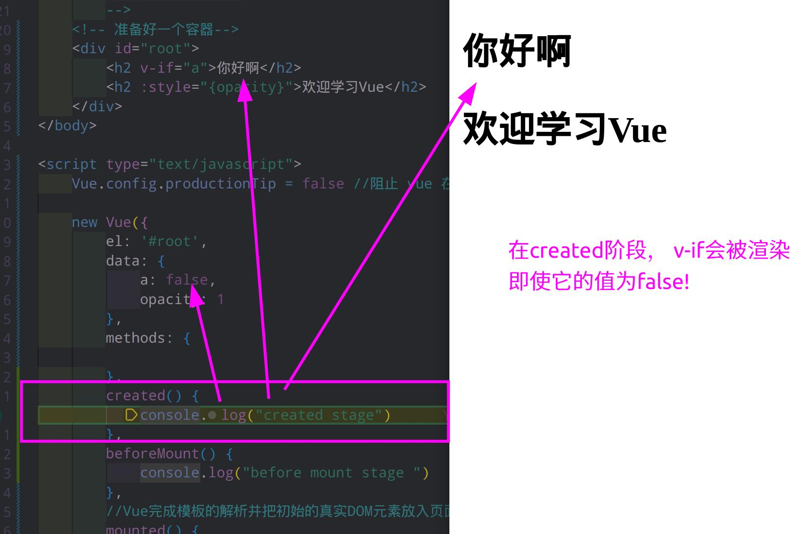
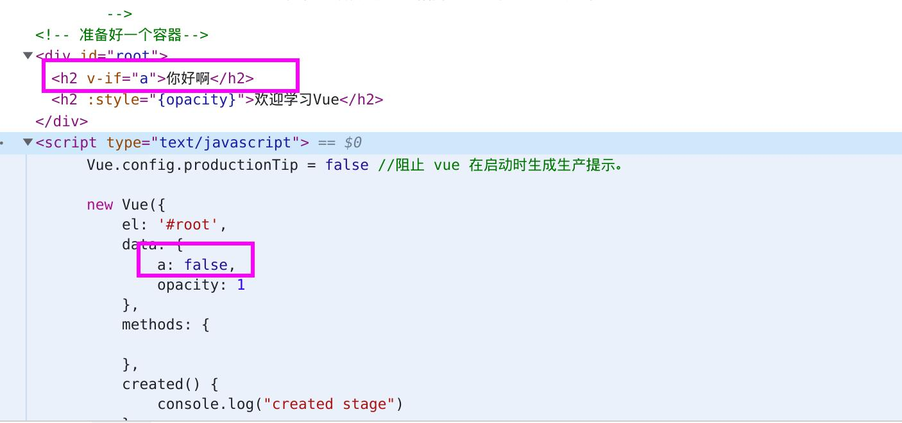

# 问题

1. 这个vue 函数的 参数是什么意思 ， 返回值是什么意思

```js
 function proxy (target, sourceKey, key) {
    sharedPropertyDefinition.get = function proxyGetter () {
      return this[sourceKey][key]
    };
```

其中，`target`​ 是目标对象，`sourceKey`​ 是源对象的 key，`key`​ 是要代理的属性名。

在 Vue 组件中，`_data`​ 和 `_props`​ 是组件的两个重要选项，它们都是对象。`_data`​ 对象包含了组件的数据，而`_props`​ 对象包含了组件接收的外部数据。

在上述代码中，`target`​ 参数指的是 Vue 组件实例对象 `vm`​，即要将代理属性绑定到 `vm`​ 上。`sourceKey`​ 参数是要代理的对象的属性名，可以是 `_data`​ 或者 `_props`​。`key`​ 参数则是具体要代理的属性名，例如 `foo`​ 或 `bar`​，即将 `vm.foo`​ 或 `vm.bar`​ 的访问代理到 `vm._data.foo`​ 或 `vm._props.bar`​ 上。

举个例子，假设 Vue 组件实例对象 `vm`​ 有如下定义：

```js
Copy code
var vm = new Vue({
  data: {
    foo: 'Hello'
  },
  props: {
    bar: String
  }
});

```

我们可以通过如下代码将 `vm.foo`​ 和 `vm.bar`​ 的访问代理到 `vm._data.foo`​ 和 `vm._props.bar`​ 上：

<pre><div class="bg-black rounded-md mb-4"><div class="flex items-center relative text-gray-200 bg-gray-800 px-4 py-2 text-xs font-sans justify-between rounded-t-md"><span>arduino</span><button class="flex ml-auto gap-2"><svg stroke="currentColor" fill="none" stroke-width="2" viewBox="0 0 24 24" stroke-linecap="round" stroke-linejoin="round" class="h-4 w-4" height="1em" width="1em" xmlns="http://www.w3.org/2000/svg"><path d="M16 4h2a2 2 0 0 1 2 2v14a2 2 0 0 1-2 2H6a2 2 0 0 1-2-2V6a2 2 0 0 1 2-2h2"></path><rect x="8" y="2" width="8" height="4" rx="1" ry="1"></rect></svg>Copy code</button></div><div class="p-4 overflow-y-auto"><code class="!whitespace-pre hljs language-arduino">proxy(vm, '_data', 'foo');
proxy(vm, '_props', 'bar');
</code></div></div></pre>

这样，我们就可以通过 `vm.foo`​ 和 `vm.bar`​ 直接访问 `vm._data.foo`​ 和 `vm._props.bar`​ 的值了。 	 

‍

## 初始渲染闪烁（flash of initial content，FOIC）

在 created 和 beforeMount 阶段，即使 `v-if`​ 条件为 false，其对应的元素也会在页面中被渲染。在 mounted 阶段才会根据条件进行显示或隐藏

现象

​运行在mouted状态时。

​​

```js
		<div id="root">
			<h2 v-if="a">你好啊</h2>
			<h2 :style="{opacity}">欢迎学习Vue</h2>
		</div>

	--------------------------------------------------------------
		 new Vue({
			el:'#root',
			data:{
				a:false,
				opacity:1
			},
			methods: {
		
			},
			created() {
				console.log("created stage")
			},
			beforeMount() {
				console.log("before mount stage ")
			},
			//Vue完成模板的解析并把初始的真实DOM元素放入页面后（挂载完毕）调用mounted
			mounted(){
				console.log("liupeitao")
				setInterval(() => {
					this.opacity -= 0.01
					if(this.opacity <= 0) this.opacity = 1
				},16)
			},
		})
```

```js
<!DOCTYPE html>
<html>

<head>
	<meta charset="UTF-8" />
	<title>引出生命周期</title>
	<!-- 引入Vue -->
	<script type="text/javascript" src="../js/vue.js"></script>
</head>

<body>
	<!-- 
				生命周期：
						1.又名：生命周期回调函数、生命周期函数、生命周期钩子。
						2.是什么：Vue在关键时刻帮我们调用的一些特殊名称的函数。
						3.生命周期函数的名字不可更改，但函数的具体内容是程序员根据需求编写的。
						4.生命周期函数中的this指向是vm 或 组件实例对象。
		-->
	<!-- 准备好一个容器-->
	<div id="root">
		<h2 v-if="a">你好啊</h2>
		<h2 :style="{opacity}">欢迎学习Vue</h2>
	</div>
</body>

<script type="text/javascript">
	Vue.config.productionTip = false //阻止 vue 在启动时生成生产提示。

	new Vue({
		el: '#root',
		data: {
			a: false,
			opacity: 1
		},
		methods: {

		},
		created() {
			console.log("created stage")
		},
		beforeMount() {
			console.log("before mount stage ")
		},
		//Vue完成模板的解析并把初始的真实DOM元素放入页面后（挂载完毕）调用mounted
		mounted() {
			console.log("liupeitao")
			setInterval(() => {
				this.opacity -= 0.01
				if (this.opacity <= 0) this.opacity = 1
			}, 16)
		},
	})

		//通过外部的定时器实现（不推荐）
	/* setInterval(() => {
		vm.opacity -= 0.01
		if(vm.opacity <= 0) vm.opacity = 1
	},16) */
</script>

</html>
```
