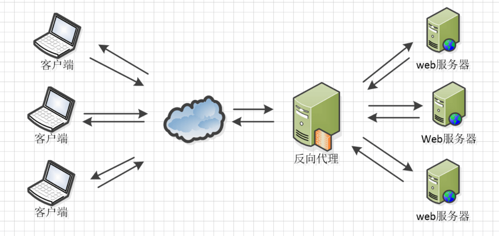
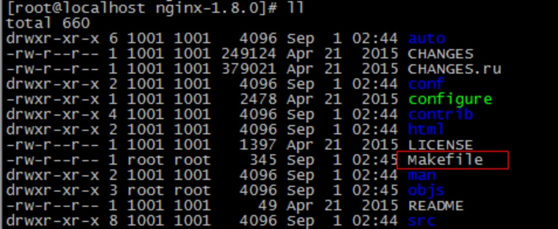
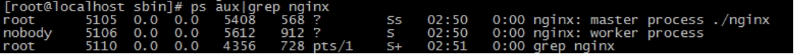
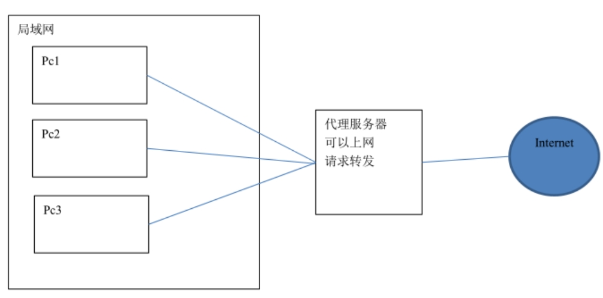
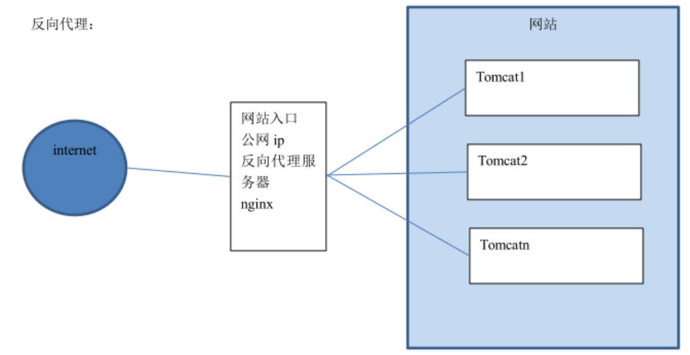
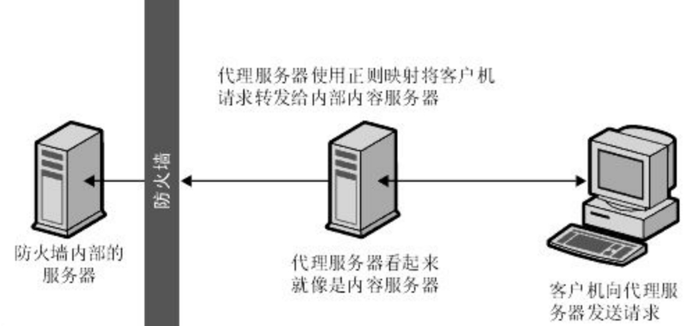

# Nginx教程

# Nginx

# [1.]()****​**课程目标**

　　[目标]()1：掌握Nginx的安装

　　目标2：掌握Nginx的静态网站部署

　　目标3：理解Nginx的反向代理与负载均衡，能够配置反向代理与负载均衡

# 课程大纲

* [1.课程目标](siyuan://blocks/20221213094955-hnbozog)
* [课程大纲](siyuan://blocks/20221213173658-tq4ojve)
* [2.Nginx的安装与启动](siyuan://blocks/20221213094955-0kqfd3p)

  * [2.1什么是Nginx](siyuan://blocks/20221213094955-9xo1i42)

    * [2.1.1 Nginx 应用场景：](siyuan://blocks/20221213094955-yfsabqm)
  * [2.2 Nginx在Linux下的安装](siyuan://blocks/20221213094955-zzghv8v)

    * [2.2.1环境准备](siyuan://blocks/20221213094955-695a7a0)
    * [2.2.2 Nginx下载](siyuan://blocks/20221213094955-q933804)
    * [2.2.3 Nginx安装](siyuan://blocks/20221213094955-1p9clyy)

      * [ 知识点小贴士](siyuan://blocks/20221213171028-32wrdxq)
  * [2.3 Nginx启动关闭与访问](siyuan://blocks/20221213094955-cp43ybn)
* [3.Nginx静态网站部署](siyuan://blocks/20221213094955-qgaxfy3)

  * [3.1 静态网站的部署](siyuan://blocks/20221213094955-fgvr4rs)
  * [3.2 配置虚拟主机](siyuan://blocks/20221213094955-q35idmb)

    * [3.2.1 端口绑定](siyuan://blocks/20221213094955-gnqwwfd)
    * [3.2.2 域名绑定](siyuan://blocks/20221213094955-0p7n2m8)
* [4.Nginx反向代理与负载均衡](siyuan://blocks/20221213094955-cqjngs4)

  * [4.1 反向代理](siyuan://blocks/20221213094955-6mon8x1)

    * [4.1.1 什么是反向代理](siyuan://blocks/20221213094955-rioe0es)
    * [4.1.2 配置反向代理-准备工作](siyuan://blocks/20221213094955-q1uexi3)
    * [4.1.3 配置反向代理](siyuan://blocks/20221213094955-idcpskx)
  * [4.2 负载均衡](siyuan://blocks/20221213094955-p28fcdw)

    * [4.2.1 什么是负载均衡](siyuan://blocks/20221213094955-40e6rfr)
    * [4.2.2 配置负载均衡-准备工作](siyuan://blocks/20221213094955-mm4incq)
    * [4.2.3 配置负载均衡](siyuan://blocks/20221213094955-gqxztf2)

# **2.Nginx的安装与启动**

## **2.1什么是Nginx**

　　Nginx 是一款高性能的 http 服务器/反向代理服务器及电子邮件（IMAP/POP3）代理服务器。由俄罗斯的程序设计师伊戈尔·西索夫（Igor Sysoev）所开发，官方测试 nginx 能够支支撑 5 万并发链接，并且 cpu、内存等资源消耗却非常低，运行非常稳定。

​​

### 2.1.1 **Nginx 应用场景：**

　　1、http 服务器。Nginx 是一个 http 服务可以独立提供 http 服务。可以做网页静态服务器。

　　2、虚拟主机。可以实现在一台服务器虚拟出多个网站。例如个人网站使用的虚拟主机。

　　3、反向代理，负载均衡。当网站的访问量达到一定程度后，单台服务器不能满足用户的请求时，需要用多台服务器集群可以使用 nginx 做反向代理。并且多台服务器可以平均分担负载，不会因为某台服务器负载高宕机而某台服务器闲置的情况。

​

## **2.2 Nginx在Linux下的安装**

　　重新准备一台虚拟机作为服务器。比如IP地址为192.168.177.129

### **2.2.1环境准备**

　　（1）需要安装 gcc 的环境

　　​`yum install gcc-c++ ​`​

　　（2）第三方的开发包。

　　  **PCRE**

　　   PCRE(Perl Compatible Regular Expressions)是一个 Perl 库，包括 perl 兼容的正则表达式库。nginx 的 http 模块使用 pcre 来解析正则表达式，所以需要在 linux 上安装 pcre 库。

　　​`yum install -y pcre pcre-devel`​

　　注：pcre-devel 是使用 pcre 开发的一个二次开发库。nginx 也需要此库。

　　   **zlib**

　　zlib 库提供了很多种压缩和解压缩的方式，nginx 使用 zlib 对 http 包的内容进行 gzip，所以需要在 linux 上安装 zlib 库。

　　​`yum install -y zlib zlib-devel`​

　　n  **OpenSSL**

　　OpenSSL 是一个强大的安全套接字层密码库，囊括主要的密码算法、常用的密钥和证书封装管理功能及 SSL 协议，并提供丰富的应用程序供测试或其它目的使用。nginx 不仅支持 http 协议，还支持 https（即在 ssl 协议上传输 http），所以需要在 linux安装 openssl 库。

　　​`yum install -y openssl openssl-devel`​

### **2.2.2 Nginx下载**

　　官方网站下载 nginx：[http://nginx.org/](http://nginx.org/)    [https://developer.aliyun.com/article/45729](https://developer.aliyun.com/article/45729)

　　我们课程中使用的版本是 1.8.0 版本。

### **2.2.3 Nginx安装**

　　第一步：把 nginx 的源码包nginx-1.8.0.tar.gz上传到 linux 系统

　　第二步：解压缩

　　​`tar zxvf nginx-1.8.0.tar.gz`​

　　第三步：进入nginx-1.8.0目录   使用 configure 命令创建一 makeFile 文件。

```bash
./configure \
--prefix=/usr/local/nginx \
--pid-path=/var/run/nginx/nginx.pid \
--lock-path=/var/lock/nginx.lock \
--error-log-path=/var/log/nginx/error.log \
--http-log-path=/var/log/nginx/access.log \
--with-http_gzip_static_module \
--http-client-body-temp-path=/var/temp/nginx/client \
--http-proxy-temp-path=/var/temp/nginx/proxy \
--http-fastcgi-temp-path=/var/temp/nginx/fastcgi \
--http-uwsgi-temp-path=/var/temp/nginx/uwsgi \
--http-scgi-temp-path=/var/temp/nginx/scgi
```

　　执行后可以看到Makefile文件

　　​

　　第四步：编译

　　​`make`​​

　　第五步：安装

　　​`make install`​​

#### **知识点小贴士**

> **configure参数**
>
> **./configure **
>
> **--prefix=/usr \                                                        指向安装目录**
>
> **--sbin-path=/usr/sbin/nginx \                                 指向（执行）程序文件（nginx）**
>
> **--conf-path=/etc/nginx/nginx.conf \                      指向配置文件**
>
> **--error-log-path=/var/log/nginx/error.log \              指向log**
>
> **--http-log-path=/var/log/nginx/access.log \            指向http-log**
>
> **--pid-path=/var/run/nginx/nginx.pid \                      指向pid**
>
> **--lock-path=/var/lock/nginx.lock \                         （安装文件锁定，防止安装文件被别人利用，或自己误操作。）**
>
> **--user=nginx **
>
> **--group=nginx **
>
> **--with-http_ssl_module \                      启用ngx_http_ssl_module支持（使支持https请求，需已安装openssl）**
>
> **--with-http_flv_module \                       启用ngx_http_flv_module支持（提供寻求内存使用基于时间的偏移量文件）**
>
> **--with-http_stub_status_module \     启用ngx_http_stub_status_module支持（获取nginx自上次启动以来的工作状态）**
>
> **--with-http_gzip_static_module \   启用ngx_http_gzip_static_module支持（在线实时压缩输出数据流）**
>
> **--http-client-body-temp-path=/var/tmp/nginx/client/ \ 设定http客户端请求临时文件路径**
>
> **--http-proxy-temp-path=/var/tmp/nginx/proxy/ \ 设定http代理临时文件路径**
>
> **--http-fastcgi-temp-path=/var/tmp/nginx/fcgi/ \ 设定http fastcgi临时文件路径**
>
> **--http-uwsgi-temp-path=/var/tmp/nginx/uwsgi \ 设定http uwsgi临时文件路径**
>
> **--http-scgi-temp-path=/var/tmp/nginx/scgi \ 设定http scgi临时文件路径**
>
> **--with-pcre 启用pcre库**

## **2.3 Nginx启动关闭与访问**

　　注意：启动nginx 之前，上边将临时文件目录指定为/var/temp/nginx/client， 需要在/var  下创建此 目录

　　​`mkdir /var/temp/nginx/client -p`​

　　进入到Nginx目录下的sbin目录

　　​`cd /usr/local/ngiux/sbin`​

　　输入命令启动Nginx

　　​`./nginx`​

　　启动后查看进程

　　​`ps aux | grep nginx`​​

​​

　　地址栏输入虚拟机的IP即可访问（默认为80端口）

　　关闭 nginx：

　　​`./nginx -s stop`​

　　或者

　　​`./nginx -s quit`​

　　重启 nginx：

　　1、先关闭后启动。

　　2、刷新配置文件：

　　​`./nginx -s reload`​

# **3.Nginx静态网站部署**

## **3.1 静态网站的部署**

　　将/资料/静态页面/index目录下的所有内容 上传到服务器的/usr/local/nginx/html下即可访问

​​

## **3.2 配置虚拟主机**

　　虚拟主机，也叫“网站空间”，就是把一台运行在互联网上的物理服务器划分成多个“虚拟”服务器。虚拟主机技术极大的促进了网络技术的应用和普及。同时虚拟主机的租用服务也成了网络时代的一种新型经济形式。

### **3.2.1 端口绑定**

　　（1）上传静态网站：

　　将/资料/静态页面/index目录上传至  /usr/local/nginx/index下

　　将/资料/静态页面/regist目录上传至  /usr/local/nginx/regist下

　　（2）修改Nginx 的配置文件：/usr/local/nginx/conf/nginx.conf

â€

> 👳小技巧
>
> sed -i '/#/d' nginx.conf        #删除配置注释
>
> sed -i '/^$/d' nginx.conf       #删除空行

```nginx
 server {
        listen       81; # 监听的端口
        server_name  localhost; # 域名或ip
        location / {	# 访问路径配置
                root   html;# 根目录
                index  index.html index.htm; # 默认首页
                }
       error_page   500 502 503 504  /50x.html;
                location = /50x.html {
                         root   html;
               }

       }
 server {
        listen       82; 
        server_name  localhost; 
        location / {
              root   html;
              index  regist.html; 
        }
        error_page   500 502 503 504 /50x.html;
        location = /50x.html {
              root   html;
        }
    }


```

　　（3）访问测试：

　　地址栏输入[http://192.168.133.130:81](http://192.168.133.130:81) 可以看到首页面

　　地址栏输入[http://192.168.133.130:82](http://192.168.133.130:82) 可以看到注册页面

### **3.2.2 域名绑定**

　　域名

　　**域名与IP绑定：**

　　一个域名对应一个 ip 地址，一个 ip 地址可以被多个域名绑定。

　　可以配置域名和 ip 的映射关系，如果 <u>**hosts 文件**</u>中配置了域名和 ip 的对应关系，不需要走dns 服务器。

　　本地测试可以修改 hosts 文件（C:\Windows\System32\drivers\etc）

　　192.168.133.130	[www.travel.com](http://www.travel.com)

　　192.168.133.130	regist.travel.com

　　做好域名指向后，修改nginx配置文件

```nginx
 server {                                                               
        listen       80;
        server_name  www.travel.com;
        location / {
            root   html;
            index  index.html;
  }
}
server {
        listen       80;
        server_name  regist.travel.com;
        location / {
            root   html;
            index  regist.html;
        }
    }
```

　　执行以下命令，刷新配置

　　[root@localhost sbin]# ./nginx -s reload

　　测试：

　　地址栏输入[http://www.travel.com/](http://www.travel.com/)

​​

　　地址栏输入[http://regist.travel.com/](http://regist.travel.com/)

​​

# **4.Nginx反向代理与负载均衡**

## **4.1 反向代理**

### **4.1.1 什么是反向代理**

　　反向代理（Reverse Proxy）方式是指以[代理服务器](http://baike.baidu.com/item/%E4%BB%A3%E7%90%86%E6%9C%8D%E5%8A%A1%E5%99%A8)来接受internet上的连接请求，然后将请求转发给内部网络上的服务器，并将从服务器上得到的结果返回给internet上请求连接的客户端，此时代理服务器对外就表现为一个反向代理服务器。

　　首先我们先理解正向代理，如下图：

​​

　　正向代理是针对你的客户端，而反向代理是针对服务器的，如下图

​​

​​

### **4.1.2 配置反向代理-准备工作**

　　（1） 将travel案例部署到tomcat中（ROOT目录），上传到服务器。

　　（2）启动TOMCAT，输入网址[http://192.168.133.130:8080](http://192.168.133.130:8080) 可以看到网站首页

### **4.1.3 配置反向代理**

　　（1）在Nginx主机修改 Nginx配置文件

```nginx
upstream tomcat-travel{
（1）在Nginx主机修改 Nginx配置文件
   upstream tomcat-travel{
	      server 192.168.133.130:8080;  
  }
    server {
        listen       80; # 监听的端口
        server_name  www.travel.com; # 域名或ip
        location / {	# 访问路径配置
            # root   index;# 根目录
	    proxy_pass http://tomcat-travel;
            index  index.html index.htm; # 默认首页
        }
}
```

　　（2）重新启动Nginx  然后用浏览器测试：[http://www.travel.com](http://www.hmtravel.com)  （此域名须配置域名指向）

## **4.2 负载均衡**

### **4.2.1 什么是负载均衡**

　　负载均衡 建立在现有网络结构之上，它提供了一种廉价有效透明的方法扩展[网络设备](http://baike.baidu.com/item/%E7%BD%91%E7%BB%9C%E8%AE%BE%E5%A4%87)和[服务器](http://baike.baidu.com/item/%E6%9C%8D%E5%8A%A1%E5%99%A8)的带宽、增加[吞吐量](http://baike.baidu.com/item/%E5%90%9E%E5%90%90%E9%87%8F)、加强网络数据处理能力、提高网络的灵活性和可用性。

　　负载均衡，英文名称为Load Balance，其意思就是分摊到多个操作单元上进行执行，例如Web[服务器](http://baike.baidu.com/item/%E6%9C%8D%E5%8A%A1%E5%99%A8)、[FTP服务器](http://baike.baidu.com/item/FTP%E6%9C%8D%E5%8A%A1%E5%99%A8)、[企业](http://baike.baidu.com/item/%E4%BC%81%E4%B8%9A)关键应用服务器和其它关键任务服务器等，从而共同完成工作任务。

### **4.2.2 配置负载均衡-准备工作**

　　（1）将刚才的存放工程的tomcat复制三份，修改端口分别为8080 ，8081，8082 。

　　（2）分别启动这三个tomcat服务。

　　（3）为了能够区分是访问哪个服务器的网站，可以在首页标题加上标记以便区分。

### **4.2.3 配置负载均衡**

　　修改 Nginx配置文件：

```nginx
 upstream tomcat-travel {
	   server 192.168.133.130:8080;
	   server 192.168.133.130:8081;
	   server 192.168.133.130:8082;
    }
    server {
        listen       80; # 监听的端口
        server_name  www.travel.com; # 域名或ip
        location / {	# 访问路径配置
            # root   index;# 根目录
	    proxy_pass http://tomcat-travel;

            index  index.html index.htm; # 默认首页
        }
        error_page   500 502 503 504  /50x.html;	# 错误页面
        location = /50x.html {
            root   html;
        }
   }
```

　　地址栏输入[http://www.travel.com/ ](http://www.travel.com/) 刷新观察每个网页的标题，看是否不同。

　　经过测试，三台服务器出现的概率各为33.3333333%，交替显示。

　　如果其中一台服务器性能比较好，想让其承担更多的压力，可以设置权重。

　　比如想让NO.1出现次数是其它服务器的2倍，则修改配置如下：

```nginx
upstream tomcat-travel {
	   server 192.168.133.130:8080;
	   server 192.168.133.130:8081 weight=2;
	   server 192.168.133.130:8082;
    }
```

　　经过测试，每刷新四次，有两次是8081

　　â€

　　â€

　　â€

　　â€

　　â€
