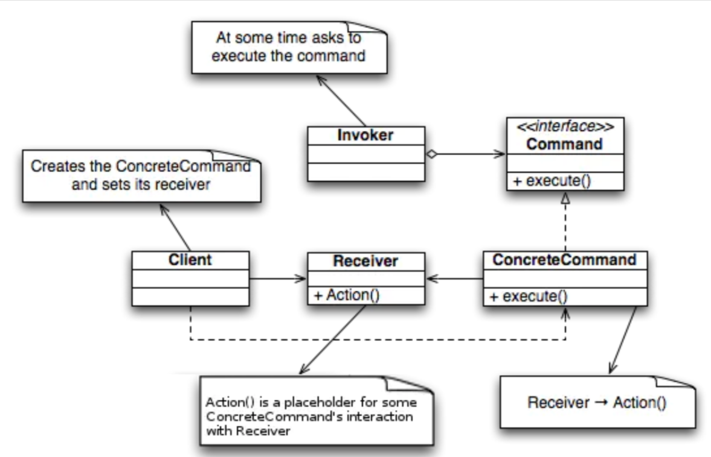

# 命令模式与MVC

命令模式在软件开发的过程中是一个非常常见的设计模式，但是可能也是日常工作中不易感知到的一种设计。

## 定义

 命令模式(Command Pattern)：把行动（action）或请求及参数封装起来，从而使我们可以用不同的请求对客户进行参数化，从而使这些行动可以被多次重复、取消、取消后重新执行。

 命令模式结构图

* Invoker：负责调用命令对象，执行命令。
* Command：需要执行的命令在这里声明。
* Receiver： 负责干活的，命令传递到这里就应该被执行了。

 命令模式让命令的发出和命令的执行独立开来，实现解耦，发出方不必需要知道接收方的接口，也不需要知道命令是怎么被接收的，什么时候执行，怎么被执行。

# 使用场景

 当需要向某些对象发送请求，但是并不知道请求的接收者是谁，也不知道接收者的操作是什么，同时发送者也不关心这些，就可以使用命令模式来实现了。例如去饭店吃饭，客人只需要点餐而不需要知道厨师是谁，厨师做菜的方式和步骤。

# 优点

 命令模式让发出方和接收方独立出来的优点就很明显，也就是常见的系统解耦的优点。

* 调用者和接受者不直接交互
* 新的命令加入会变得简单
* 可以容易的设计一个命令队列
* 可以方便的撤销和重新执行命令

# 缺点

* 命令模式可能会导致系统中有过多种类的命令，因为每个命令都需要设计一个具体的命令类，因此可能会使系统有大量的具体命令类，从而变得混乱臃肿。

# 实例

 就像开头提到的，在项目开发中，我们使用了大量的设计模式，只是这些设计模式都被封装在了框架中了，比如Web的MVC框架中，命令模式就是其中使用到的设计模式之一。

 例如在Spring MVC中，当Servlet容器接收到一个HTTP请求，此时Servlet容器，例如Tomcat，相当于Invoker，会通过路由找到对应的Controller来出来请求，此时的Controller相当于Command，而具体处理根据路由分发请求到具体的Controller则是ConcreteCommand，这里Tomcat并不需要知道Controller是怎么接收和实现的，也不需要知道是哪个Controller在执行，它只是负责发送命令，这样就实现了Servlet容器与Web实例的一个解耦。当有新的请求业务，只需要添加新的Controller就可以了。

 使用过或者维护过老版本Spring MVC的人应该知道，Spring MVC被称为配置地狱，各种Controller，Service需要配置在xml文件中，这其实就是命令模式缺点的体现，当系统业务过多，大量具体的命令类就难以管理。但是现在Spring使用注解的方式从xml配置中解放了出来，具体的命令实现类只需要使用Controller和Mapping注解，就完成了具体命令类的实现，其实这其中又使用了工厂模式(如BeanFactory) 和策略模式(如注解)来对于命令模式的缺点进行优化。

作者：程序员札记  
链接：https://www.jianshu.com/p/c3f217e939a1  
来源：简书  
著作权归作者所有。商业转载请联系作者获得授权，非商业转载请注明出处。

‍
