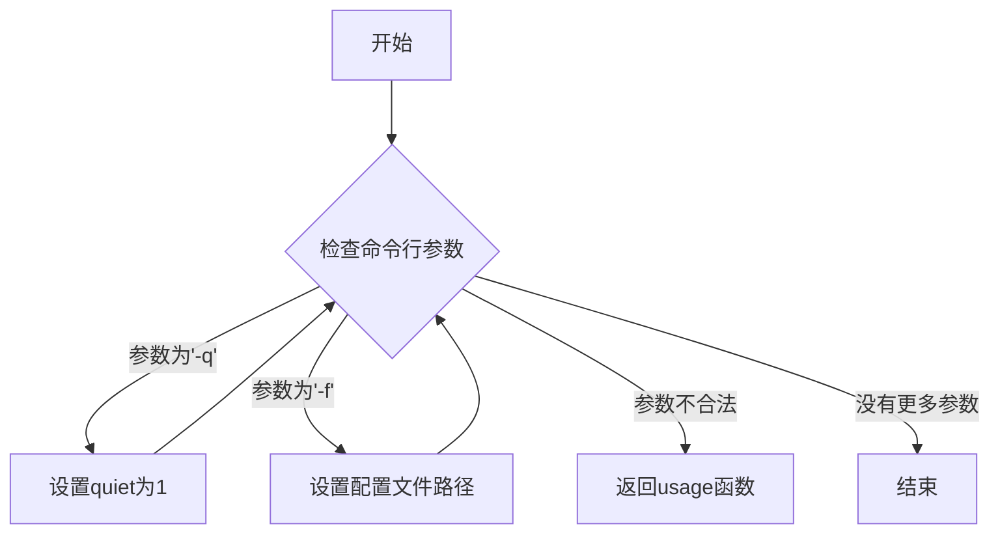
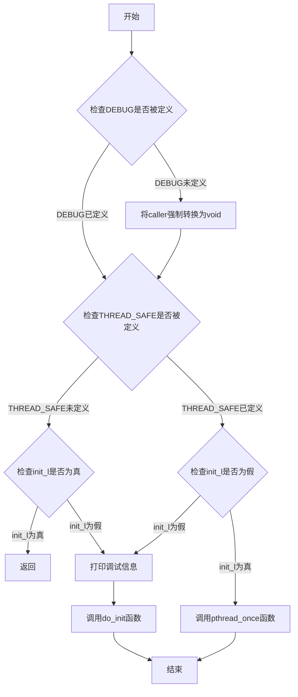
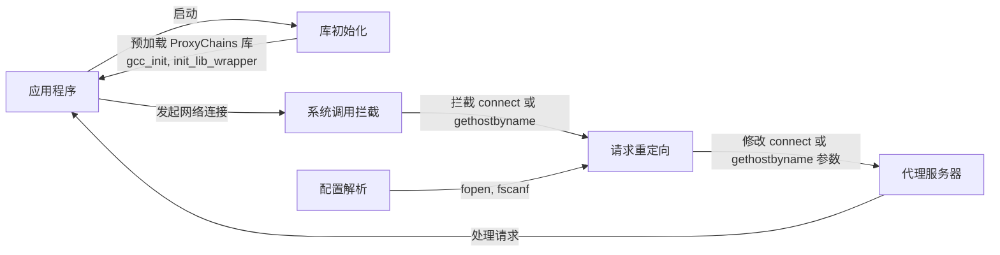

```mermaid

graph TB

A[开始]

B{检查命令行参数}

C[设置quiet为1]

D[设置配置文件路径]

E[返回usage函数]

F[结束]

A --> B

B -- 参数为'-q' --> C

B -- 参数为'-f' --> D

B -- 参数不合法 --> E

C --> B

D --> B

B -- 没有更多参数 --> F

```

```mermaid
graph TB
    A[开始]
    B{检查DEBUG是否被定义}
    C[将caller强制转换为void]
    D{检查THREAD_SAFE是否被定义}
    E{检查init_l是否为真}
    F[返回]
    G[打印调试信息]
    H[调用do_init函数]
    I{检查init_l是否为假}
    J[调用pthread_once函数]
    K[结束]
    A --> B
    B -- DEBUG未定义 --> C
    B -- DEBUG已定义 --> D
    C --> D
    D -- THREAD_SAFE未定义 --> E
    E -- init_l为真 --> F
    E -- init_l为假 --> G
    G --> H
    H --> K
    D -- THREAD_SAFE已定义 --> I
    I -- init_l为假 --> G
    I -- init_l为真 --> J
    J --> K
```

```mermaid
graph LR
    A[应用程序] -->|启动| B[库初始化]
    B -->|预加载 ProxyChains 库gcc_init, init_lib_wrapper| A
    A -->|发起网络连接| C[系统调用拦截]
    C -->|拦截 connect 或 gethostbyname| D[请求重定向]
    D -->|修改 connect 或 gethostbyname 参数| E[代理服务器]
    E -->|处理请求| A
    F[配置解析] -->|fopen, fscanf| D
```

