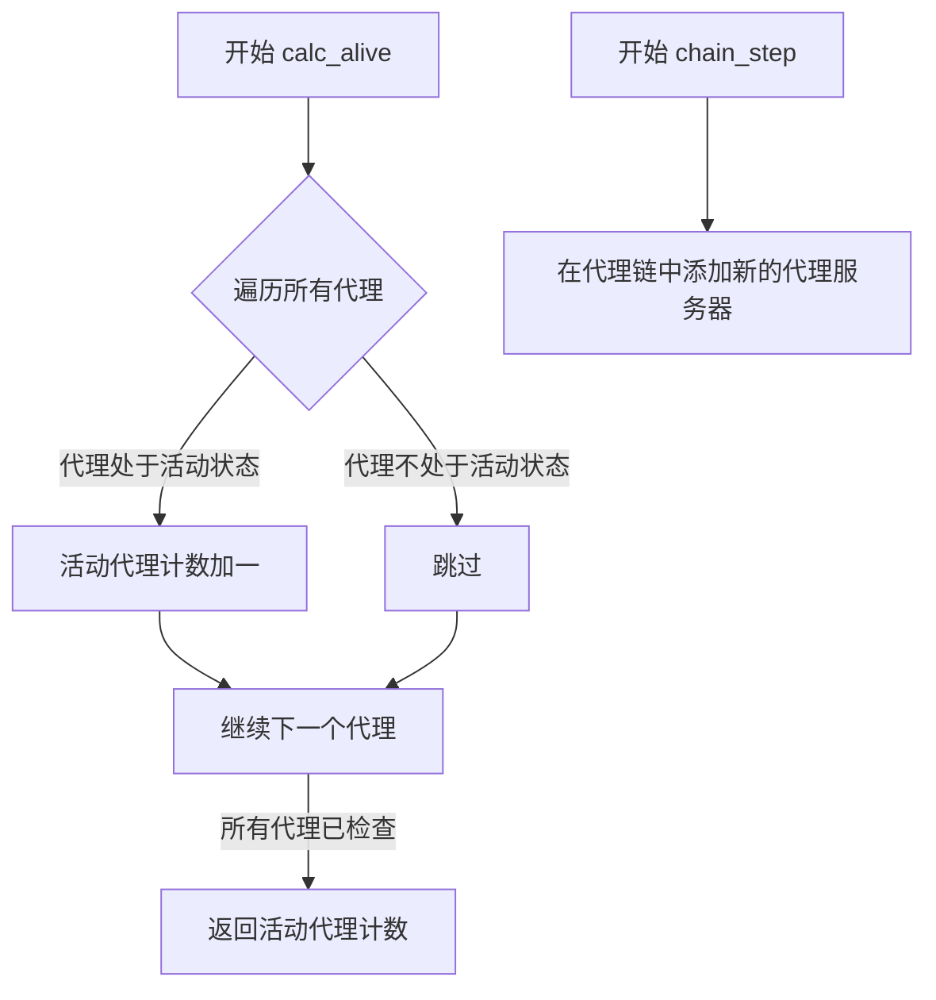
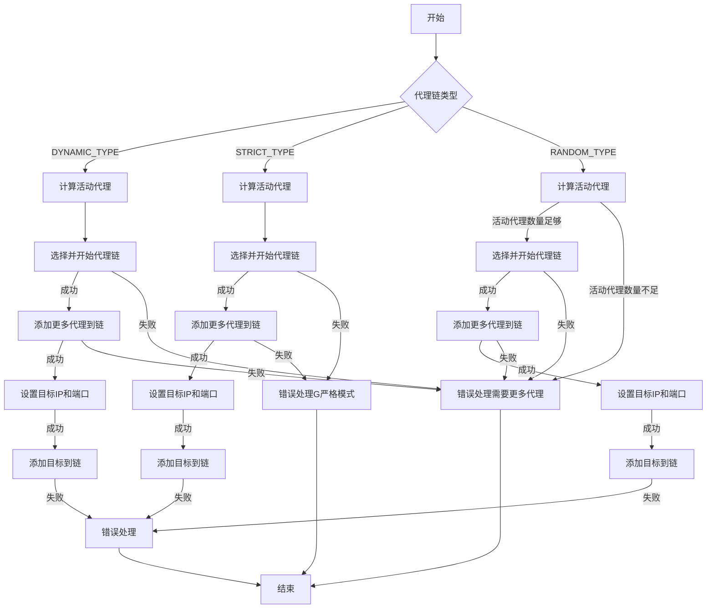

```mermaid
graph TB
    A[开始 calc_alive] --> B{遍历所有代理}
    B -- 代理处于活动状态 --> C[活动代理计数加一]
    B -- 代理不处于活动状态 --> D[跳过]
    C --> E[继续下一个代理]
    D --> E
    E -- 所有代理已检查 --> F[返回活动代理计数]
    G[开始 chain_step] --> H[在代理链中添加新的代理服务器]
```

```mermaid

graph TB

A[开始] --> B{代理链类型}

B -- DYNAMIC_TYPE --> C1[计算活动代理]

C1 --> D1[选择并开始代理链]

D1 -- 成功 --> E1[添加更多代理到链]

E1 -- 成功 --> F1[设置目标IP和端口]

F1 -- 成功 --> G1[添加目标到链]

G1 -- 失败 --> H[错误处理]

D1 -- 失败 --> I[错误处理需要更多代理]

E1 -- 失败 --> I

B -- STRICT_TYPE --> C2[计算活动代理]

C2 --> D2[选择并开始代理链]

D2 -- 成功 --> E2[添加更多代理到链]

E2 -- 成功 --> F2[设置目标IP和端口]

F2 -- 成功 --> G2[添加目标到链]

G2 -- 失败 --> H

D2 -- 失败 --> J[错误处理G严格模式]

E2 -- 失败 --> J

B -- RANDOM_TYPE --> C3[计算活动代理]

C3 -- 活动代理数量足够 --> D3[选择并开始代理链]

D3 -- 成功 --> E3[添加更多代理到链]

E3 -- 成功 --> F3[设置目标IP和端口]

F3 -- 成功 --> G3[添加目标到链]

G3 -- 失败 --> H

C3 -- 活动代理数量不足 --> I

D3 -- 失败 --> I

E3 -- 失败 --> I

H --> K[结束]

I --> K

J --> K

```

